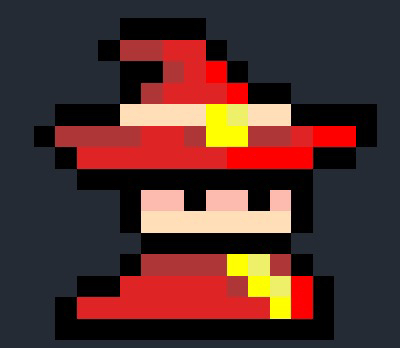

 

  

<h3 align="center">JustAnRPG (working title)</h3>

  

    This is a small, independent game by myself, with some help from others. A top-down 2d spell-comboing game that has unique spells, animations and interactions!
     
    <a href="https://github.com/sakata24/JustAnRPG"><strong>Explore the docs »</strong></a>
     
     
    <a href="https://github.com/sakata24/JustAnRPG">View Demo</a>
    ·
    <a href="https://github.com/sakata24/JustAnRPG/issues/new?labels=bug&template=bug-report---.md">Report Bug</a>
    ·
    <a href="https://github.com/sakata24/JustAnRPG/issues/new?labels=enhancement&template=feature-request---.md">Request Feature</a>
  

